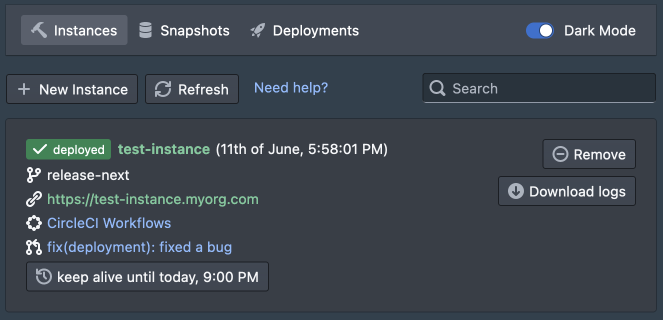
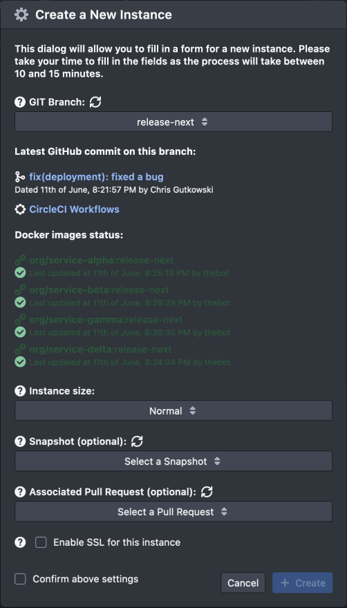

## Test Instances Deployment Panel project showcase

### Problem

The team had issues testing different features on the same environment, so they decided to find a solution to make feature testing easier.

### Basic requirements

- The solution should be easy and accessible to any technical member of the team without any need to ask the DevOps team each time a test environment is needed.
- Provisioned individual test environments should be configurable (selectable GIT branch, for example), short-lived, shareable, and cost-efficient.
- Use a private cloud or Azure for this task.
- Make the solution extendable so new features can be added later (spoiler: a lot more other features were added later in contrast to the basic requirements).

### Research

I was the sole person responsible for developing the solution and conducted enough research before starting to implement the solution. The requirements were rather general, so I had a lot of freedom to make my own decisions. Because of short liveness nature of mentioned test environments, I decided to use a public cloud [Azure](https://azure.microsoft.com/) to make the solution more cost-effective and potentially faster to spin up. I knew it would also help with horizontal scaling the solution practically indefinitely. Our service components were already Dockerized, but I optimized them further to decrease the build time and result image sizes. After some research, I decided to use [Azure Container Instances](https://azure.microsoft.com/en-us/products/container-instances/) because it allowed me to focus on the design and configuration without worrying too much about the management aspect. For provisioning, I used [Terraform](https://www.terraform.io), which allowed me to define consistent configuration files across different feature test environments that had to be created and destroyed on-demand (more on later). As for automation, I used [GitHub Actions](https://github.com/features/actions) because it allowed me to configure more granular workflows for different tasks compared to [CircleCI](https://circleci.com), which the team used at that time.

### First revision of the solution

After making architectural decisions, I started implementing a Proof of Concept for Terraform provisioning files creating [Azure Container Group](https://learn.microsoft.com/en-us/azure/container-instances/container-instances-container-groups) for the feature test environment. By implementing this PoC, I successfully tested and validated the design goals for this particular function. The second part of the solution was to implement and configure reusable GHA workflows and backend for dispatching the workflows from the frontend application. The final piece was for the user interface layer, where I created an application with one of the UI libraries. I aimed for UI to be easy to use and minimalistic.

That concludes the project's background, the research, and the first revision of the solution. In the remaining part of the document, I will showcase the solution in its final form after adding more requirements and appearing during the usage of the described solution, because it was a long-term project that was evolving with the team and its processes, but those things are outside of the scope of this document.

### Final Solution

This section will describe the final solution underlying components used in the team's workflow.

### Terraform files for creating the desired solution

I won't go into the details of what exact code is inside the Terraform configuration template files, but here is the file structure:

```
test-instances
  - main.tf
  - output.ts
  - README.md
  - setup.tf
  - variables.tf
```

- `main.tf` used for provisioning [`azurerm_container_group`](https://registry.terraform.io/providers/hashicorp/azurerm/latest/docs/resources/container_group) resource. It has the definitions for creating the containers of the services used in the project. The containers have environment variables configured, are resource managed and some of the services are sharing the persistent storage.
- `output.ts` is used for returning the output values such as the result FQDN or IP address of the provisioned environment.
- `README.md` contains detailed instructions on configuring the provisioning files and using them during development.
- `setup.tf` has Terraform backend and provider configuration.
- `variables.tf` has definitions of the variables and local values.

### GitHub Actions workflow and the Backend server

I created two [workflow files](https://docs.github.com/en/actions/using-workflows/workflow-syntax-for-github-actions) dispatchable via [`workflow_dispatch`](https://docs.github.com/en/actions/using-workflows/events-that-trigger-workflows#workflow_dispatch). One for completing the test instance and another one for destroying it. The workflows have shared steps for setting up Terraform and applying/destroying the test instances. Both workflows accept the same input parameters passed via the `workflow_dispatch` event. The workflow for destroying a test instance has additional steps for fallback when the GIT branch is non-existing anymore.

The backend [Node.js](https://nodejs.org/) server accepts HTTP requests and has different features for provisioning the solution and other helper functionalities. Those features are described in more detail in the "User Interface" section for a more straightforward and visual explanation. The backend connects with different APIs such as Azure API, [Docker Hub](https://docs.docker.com/docker-hub/api/latest/), [GitHub API](https://docs.github.com/rest), [GitHub Webhooks](https://docs.github.com/en/developers/webhooks-and-events/webhooks/about-webhooks), [Google Chat](https://developers.google.com/chat), and Let's Encrypt manager. It also has a basic storage functionality for storing the state of the test instances.

### User Interface

I used [React.js](https://reactjs.org/) for implementing the UI and used one of the popular UI libraries, so we didn't have to involve the designer. Without going into coding details, I will show different components of the UI and explain the underlying logic behind those components.

#### A list of test instances



Below is an explanation of the displayed elements:
- Top three tabs allow switching between different views
  - Instances - test instances described in this document
  - Snapshots - used to start a test instance from a selected state, outside of the scope of this document
  - Deployments - used for release management, outside of the scope of this document
- "+ New Instance" button to create a new test instance and the "Refresh" button to refresh the list of test instances.
- Below a list of test instances with subcomponents:
  - a badge with the state of the deployment of the test instance
  - the name of the instance and its deployment date
  - a branch based on which the instance was created
  - a link to the instance
  - a link to CircleCI workflow related to that instance
  - a link to related pull request on GitHub
  - on the bottom, a button allows setting the date and time until the instance should run. This is used to delete the test instances to save costs automatically.
  - on the right, a button deletes a test instance manually and a button to download instance logs (for debugging).

#### Create a New Instance dialog



Here is an explanation of the displayed elements:
- GIT branch select input to create a test instance from.
- text with a link to the latest commit available for the selected branch.
- link to the CircleCI workflow that should create needed Docker images.
- a list of Docker images along with a status build for them. If some Docker images are not made yet, the UI alerts the user about the incomplete status.
- Instance size allows selecting from Normal and Large. A large instance size will allocate more CPU and memory resources to the configured test instance. Such an option has proven useful for feature branches requiring more calculation power.
- Snapshot input for selecting the database state from which the test instance should start. This feature would deserve separate documentation due to its size and complexity.
- Associated Pull Request input to select for more straightforward navigation between the deployment panel and the PRs. This is useful because the deployment panel is coupled to the standard workflow the team is following.
- a checkbox to enable optional TLS termination using Let's Encrypt.
- a confirmation checkbox is required to enable the "+ Create" button.
- "+ Create" button will send a request to the backend, which will dispatch the GHA workflow that will provide the test instance using Terraform.

### Summary

This was an overview of a tailored solution for creating test environments based on GIT feature branches. In the end, the project was very successful and may be used to this day, especially by the QA team.
